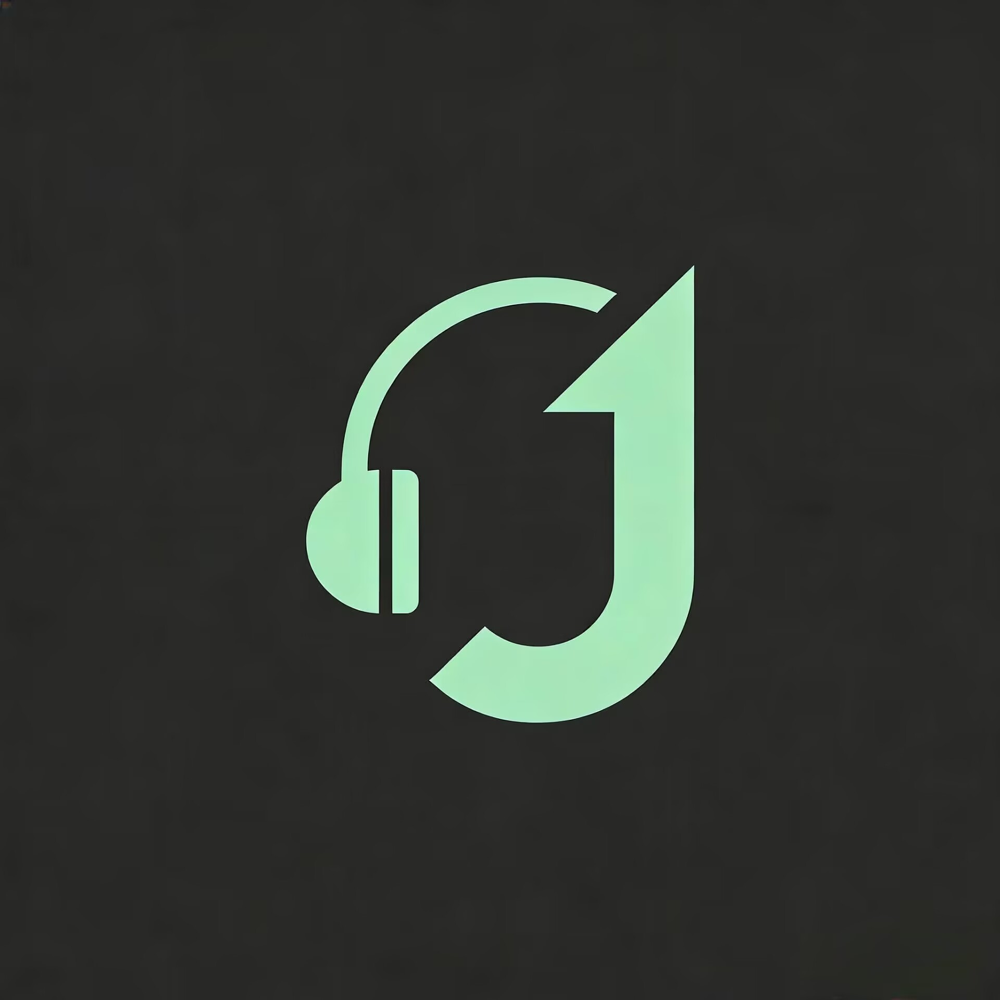
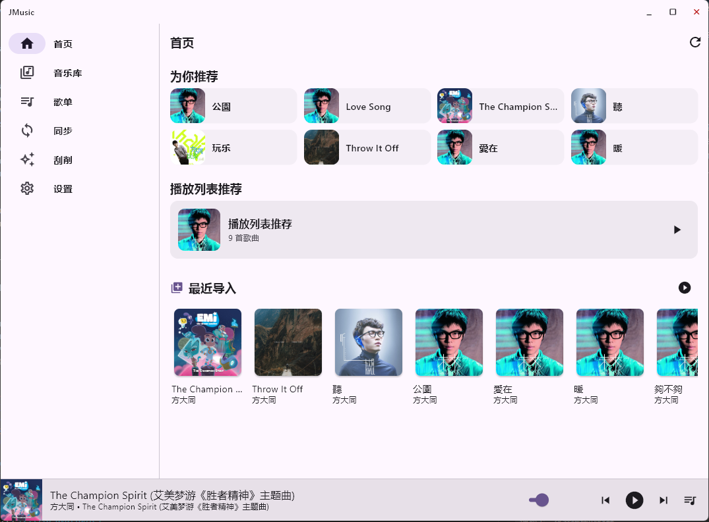
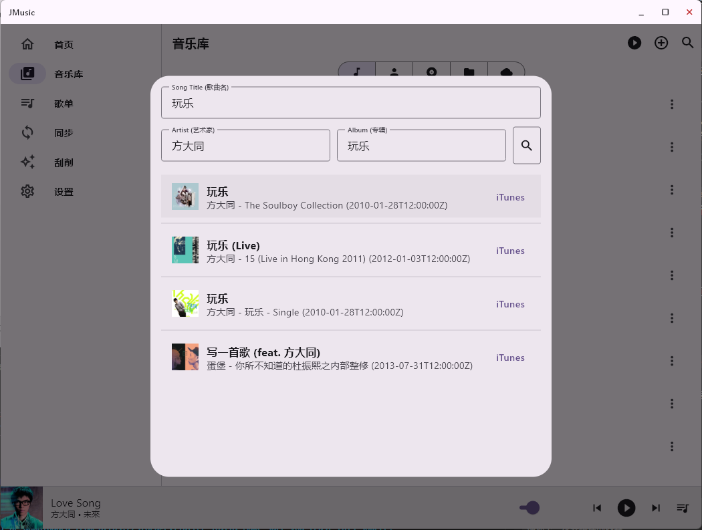
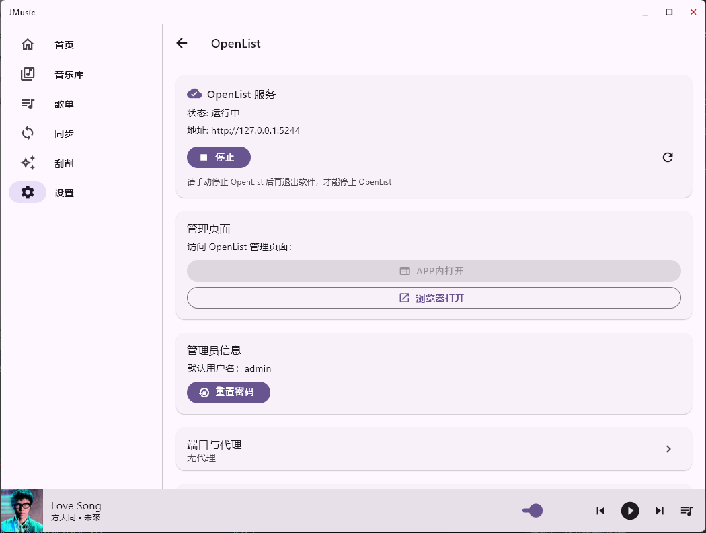
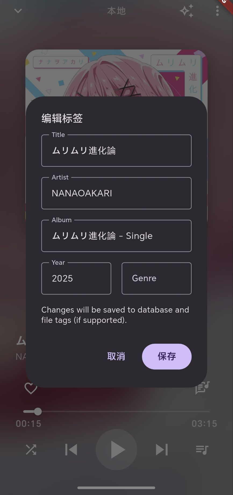
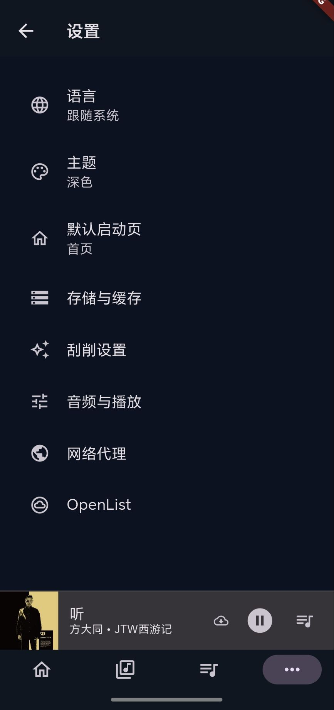
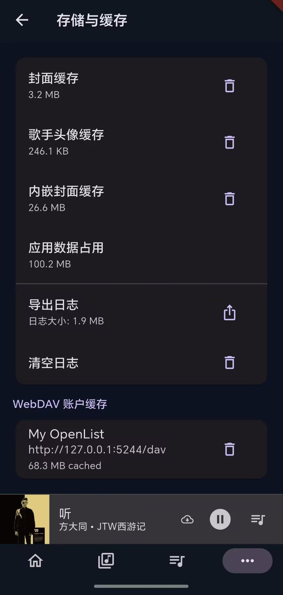
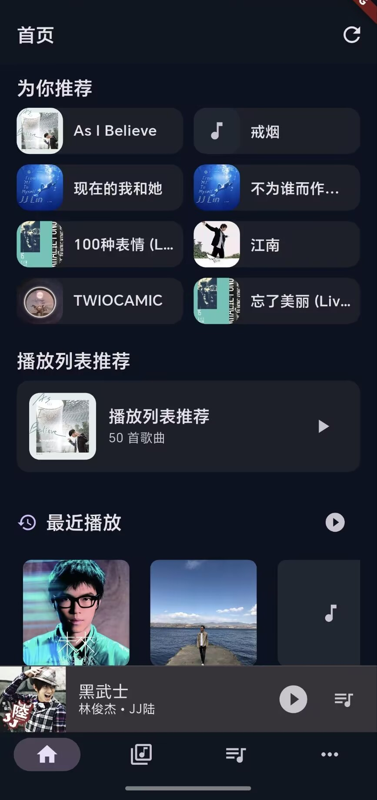

# JMusic

<p align="center">
  
</p>

English | [中文](README.md)

A cross-platform local music and video player with WebDAV access, and a built-in OpenList local service for online cloud drive access.

----------------------------------

## Features

- 🔍 Local music library scan and management
- ▶️ Playback queue, mini player, and video playback
- 📁 Playlists and basic library organization
- ☁️ WebDAV sync and configuration
- 🧩 Built-in OpenList server management (local service)
- 🏷️ Metadata scraping and ID3 tag parsing:
  - Local song recognition
  - [iTunes](https://www.apple.com/hk/itunes/)
  - [MusicBrainz](https://musicbrainz.org/)
  - [Lrclib](https://lrclib.net)
  - [QianGuBaFang's LRC Lyric Server](https://tools.rangotec.com/qqlrcup)
- 🌐 OpenList native service support

## Feature Showcase
<p align="center">


</p>
<p align="center">


</p>

<p align="center">



</p>

<p align="center">



</p>

## OpenList Integration

This project embeds OpenList as a local service:

- Backend source: `openlist-backend/`
- Frontend assets: cached by `openlist-jmusic-lib/frontends/dist`
- Android bundles OpenList as an AAR and assets under `android/app/src/main/assets/openlist/`
- Desktop runtime path (Windows/macOS/Linux): `~/Documents/j_music/openlist/`

In-app WebView is enabled on Android and iOS only; desktop platforms open the management page in an external browser.

## Repository Layout

- `lib/core`: shared services, theme, utils, widgets
- `lib/features`: feature modules (library, player, sync, scraper, settings)
- `openlist-backend`: OpenList backend source (third-party)
- `openlist-jmusic-lib`: unified build scripts for OpenList across platforms

## Development Setup

### Prerequisites

- Flutter SDK (3.2+)
- Dart SDK (bundled with Flutter)
- Android SDK + NDK (NDK 27.0.12077973 is used in `android/app/build.gradle.kts`)
- Go toolchain (for OpenList builds)
- bash environment (Git Bash, WSL, or macOS/Linux)

### Quick Start

```bash
flutter pub get
dart run build_runner build
flutter run
```

## OpenList Build Scripts

All OpenList build steps are centralized in `openlist-jmusic-lib/`.

```bash
# initialize OpenList source (in openlist-backend)
./openlist-jmusic-lib/build.sh init

# fetch frontend assets
./openlist-jmusic-lib/build.sh frontend

# build Android AAR
./openlist-jmusic-lib/build.sh android

# build iOS xcframework (macOS only)
./openlist-jmusic-lib/build.sh ios

# build desktop/server binaries
./openlist-jmusic-lib/build.sh desktop release
```

Output locations:

- Android AAR: `android/app/libs`
- Android OpenList assets: `android/app/src/main/assets/openlist/dist`
- iOS xcframework: `ios/Frameworks`
- Desktop runtime:
  - Windows: `C:\Users\<user>\Documents\j_music\openlist\openlist.exe`
  - macOS/Linux: `~/Documents/j_music/openlist/openlist`

See `openlist-jmusic-lib/README.md` for platform-specific prerequisites (MSYS2 UCRT64, gomobile, etc.).

## Notes for Contributors

- Code generation: `dart run build_runner build`
- OpenList assets and binaries are not committed; build them locally using the scripts above.
- Android uses a bundled AAR and local assets; desktop runs OpenList from the user Documents folder.

## Third-Party Projects

This project integrates the following upstream projects:

- OpenList backend: https://github.com/OpenListTeam/OpenList (AGPL-3.0)
- OpenList frontend: https://github.com/OpenListTeam/OpenList-Frontend

Please follow their licenses and attribution requirements when redistributing.

## License

This project is licensed under GPL-3.0. See the [LICENSE](LICENSE) file for details.

## Acknowledgments

Thanks to all contributors and the open-source community, especially the developers of the OpenList project.

Please follow their licenses and attribution requirements when redistributing.
